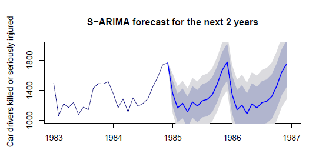

# Time series: Predicting the monthly number of serious car accident in Great Britain

In this project we study a time series representing the monthly number of Car drivers killed or
seriously injured in Great Britain, from January 1969 to December 1984, and predict the monthly number of accident for the year 1985.

After a data exploration step, appropriate transformations are applied to make the serie stationary before modeling it using various methods 
(ARMA,S-ARIMA, Wolt-Winter model and a Random Forest model taking into account lagged features). 	
Their performance is then evaluted using adequate statistical testing and metrics.

